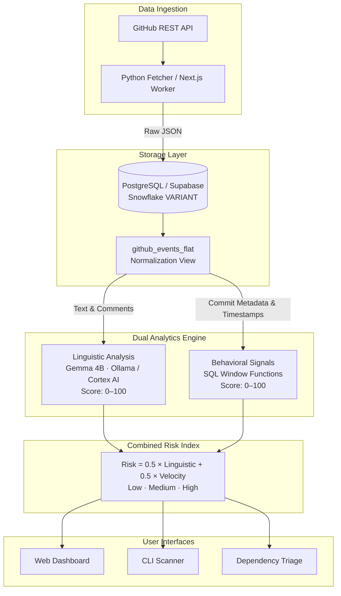

# Ghost Maintainer

> Predict open-source supply chain compromises before they happen — by monitoring the humans behind the code.

Ghost Maintainer is an AI-powered security intelligence tool that detects maintainer burnout, social engineering, and account takeover risk in open-source projects. It combines **Gemma 4B** linguistic analysis of maintainer communications with **statistical behavioral signals** computed via pure SQL window functions to produce a unified risk score (0–100) for any GitHub repository.

Unlike dependency scanners that react after a vulnerability is disclosed, Ghost Maintainer surfaces early warning indicators weeks before a compromise occurs — validated against real-world incidents including the [xz-utils backdoor (CVE-2024-3094)](https://nvd.nist.gov/vuln/detail/CVE-2024-3094), the [event-stream npm hijack](https://blog.npmjs.org/post/180565383195/details-about-the-event-stream-incident), and the [ua-parser-js credential theft](https://github.com/nicolo-ribaudo/tc39-proposal-structs/issues/1).

---

## Features

- **Risk Scoring Engine** — Dual-analysis pipeline combining LLM linguistic evaluation with quantitative behavioral metrics into a single 0–100 risk index.
- **5 Behavioral Signals** — Activity drop detection, commit time-shift analysis (L₁ distribution drift), new-author surge tracking, unreviewed merge monitoring, and reply latency spike detection — all computed in pure SQL.
- **Gemma 4B Integration** — Runs fully offline via Ollama or llama.cpp. Evaluates maintainer exhaustion, coercion patterns, sockpuppet indicators, and takeover language from issue comments and PR discussions.
- **Interactive Web Dashboard** — Next.js 16 application with risk gauges, trend charts, behavioral signal meters, and Gemma explanation panels.
- **CLI Scanner** — Available in both Python and Node.js. Scan individual repositories or audit all dependencies in a `package.json` with a single command.
- **Dependency Triage** — In-browser and CLI-based `package.json` scanner that batch-evaluates your dependency tree for supply chain risk.
- **Incident Case Studies** — Pre-computed telemetry for known supply chain attacks, enabling instant side-by-side comparison without any configuration.

---

## Architecture



For the full architecture specification, data flow diagrams, and mathematical definitions, see [`docs/ARCHITECTURE.md`](./docs/ARCHITECTURE.md).

---

## Risk Score

The combined risk score is a weighted average of two independent assessments:

```
Risk Score = 0.5 × Linguistic Score + 0.5 × Velocity Score
```

| Component | Source | Method |
|---|---|---|
| **Linguistic Score** (0–100) | Issue comments, PR discussions, maintainer messages | Gemma 4B evaluates exhaustion, coercion, sockpuppet indicators |
| **Velocity Score** (0–100) | Commit metadata, PR reviews, issue timestamps | 5 behavioral signals computed via SQL window functions |

### Behavioral Signals

| Signal | What it Detects |
|---|---|
| **Activity Drop** | Weekly commits and reviews falling below the 90-day moving average |
| **Commit Time Shift** | Hour-of-day distribution drift (L₁ distance between baseline and recent 30 days) |
| **New-Author Surge** | Disproportionate commits from authors first seen in the last 30 days |
| **Unreviewed Merges** | Pull requests merged without review comments or peer approvals |
| **Reply Latency Spike** | Issue time-to-first-reply deviating significantly from baseline (Z-score) |

---

## Getting Started

### Prerequisites

- **Node.js** ≥ 18
- **Python** ≥ 3.10 *(optional, for the Python CLI and data fetcher)*
- **Ollama** *(optional, for local Gemma inference)*

### Installation

```bash
git clone https://github.com/nonsense3/Ghost-Maintainer.git
cd Ghost-Maintainer
npm install
```

For the web application:

```bash
cd web
npm install
```

For the Python data fetcher:

```bash
cd fetcher
pip install -r requirements.txt
```

---

## Usage

### Scan Any GitHub Repository

Assess the supply chain risk of any public GitHub repository by passing `owner/repo`:

```bash
# Scan a repository (e.g., your own project's dependency)
node cli/scan.mjs scan facebook/react
node cli/scan.mjs scan expressjs/express
node cli/scan.mjs scan tukaani-project/xz

# With a GitHub token for higher rate limits
node cli/scan.mjs scan <owner>/<repo> --token ghp_your_token_here
```

Or via npm scripts:

```bash
npm run scan:repo -- <owner>/<repo>
```

The scanner fetches live commit, PR, and issue data from the GitHub API, computes all 5 behavioral signals, runs keyword-based linguistic analysis, and outputs a full risk report in the terminal.

### Audit Your Dependencies

Scan every dependency listed in your project's `package.json` for supply chain risk:

```bash
# Audit the web app's dependencies
npm run scan:deps

# Audit any package.json file
node cli/scan.mjs scan-deps --file /path/to/your/project/package.json
```

This outputs a table with risk scores and bands for each dependency, flagging any packages with known incidents (e.g., `event-stream`, `ua-parser-js`, `colors`).

### Run the Demo

See pre-computed risk assessments for known supply chain incidents without any API calls:

```bash
npm run scan
```

This displays side-by-side reports for `xz-utils` (86 — High Risk) vs. `pallets/flask` (13 — Low Risk).

### Web Dashboard

```bash
npm run dev
```

Open [http://localhost:3000](http://localhost:3000). The dashboard includes:

- **Incident Study** — Interactive comparison of real supply chain incidents with behavioral signal breakdowns.
- **Dependency Scanner** — Upload or paste a `package.json` to triage your dependency tree in-browser.
- **SQL Signals Showcase** — Interactive breakdown of all 5 behavioral signal computations.
- **Repository Detail** — Risk gauge, score trend over time, behavioral meters, and Gemma explanation panels.

### Python CLI (Alternative)

```bash
python cli/scan.py demo                    # Demo mode
python cli/scan.py scan <owner>/<repo>     # Scan a repository
```

### Supabase Setup (Optional)

Required only for persistent custom repository tracking with authentication.

1. Create a project at [supabase.com](https://supabase.com).
2. Run migrations in the SQL Editor in order:
   - `supabase/migrations/20260307180000_init.sql`
   - `supabase/migrations/20260307200000_flatten_view.sql`
   - `supabase/migrations/20260307210000_behavior_views.sql`
3. Configure environment variables:
   ```bash
   cp web/.env.example web/.env.local
   ```
4. Populate `web/.env.local`:
   ```env
   NEXT_PUBLIC_SUPABASE_URL=https://<project>.supabase.co
   NEXT_PUBLIC_SUPABASE_ANON_KEY=<anon-key>
   SUPABASE_SERVICE_ROLE_KEY=<service-role-key>
   GITHUB_TOKEN=ghp_...
   OLLAMA_HOST=http://127.0.0.1:11434
   GEMMA_MODEL=gemma:4b
   ```

### Ollama / Gemma Setup (Optional)

For local, fully offline linguistic analysis:

```bash
ollama pull gemma:4b
ollama serve
```

Ghost Maintainer will automatically connect to the local Ollama instance at `http://127.0.0.1:11434`.

---


## Tech Stack

| Layer | Technology |
|---|---|
| **Frontend** | Next.js 16, React 19, Tailwind CSS 4, Lucide Icons |
| **Database** | PostgreSQL (Supabase) with RLS, Snowflake |
| **AI / LLM** | Gemma 4B via Ollama, Snowflake Cortex AI |
| **Data Ingestion** | Python (requests, supabase-py), GitHub REST API |
| **Validation** | Zod 4, TypeScript 5 |
| **Rate Limiting** | Upstash Redis + Ratelimit |

---

## Documentation

| Document | Description |
|---|---|
| [`docs/ARCHITECTURE.md`](./docs/ARCHITECTURE.md) | System diagram, risk formulas, data flow, and behavioral signal mathematics |
| [`docs/DEMO_SCRIPT.md`](./docs/DEMO_SCRIPT.md) | Structured presentation walkthrough |
| [`docs/JUDGES_GUIDE.md`](./docs/JUDGES_GUIDE.md) | Track-by-track criteria with code references |
| [`DESIGN-apple.md`](./DESIGN-apple.md) | Design system specification |
| [`sql/README.md`](./sql/README.md) | SQL layer documentation |

---

## Contributing

Contributions are welcome. Please open an issue to discuss proposed changes before submitting a pull request.

1. Fork the repository
2. Create a feature branch (`git checkout -b feature/your-feature`)
3. Commit your changes (`git commit -m "Add your feature"`)
4. Push to the branch (`git push origin feature/your-feature`)
5. Open a pull request

---

## License

This project is licensed under the MIT License. See [`LICENSE`](./LICENSE) for details.
