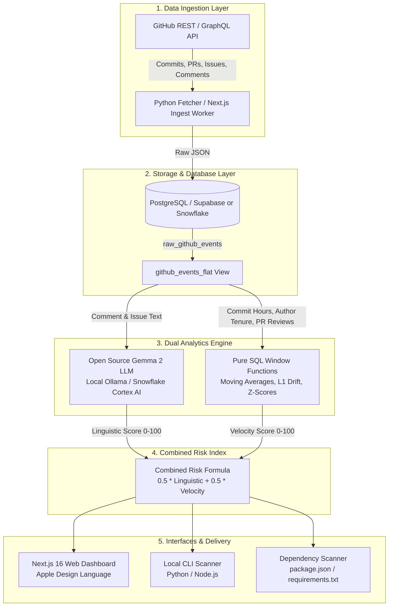

# Ghost Maintainer — Architecture & Technical Specifications

> **One-line pitch:** "Dependabot tells you after a bug is found. Ghost Maintainer warns you weeks before the package is compromised."

Ghost Maintainer monitors the **human and organizational layer** of open-source software libraries. Instead of inspecting code syntax alone, it monitors maintainer exhaustion, sudden shifts in commit patterns, influx of unvetted contributors, and coercive communications.

---

## 1. System Architecture

---

## 2. The Risk Score Formula (PRD §6)

$$\text{Risk Score} = 0.5 \times \text{Linguistic Score} + 0.5 \times \text{Velocity Score}$$

- **Linguistic Score (0–100):** Average score across analyzed comments evaluated by Gemma 2.
- **Velocity Score (0–100):** Composite index across the 5 behavioral signals.

### Risk Bands:
- **Low Risk (0–33):** Stable multi-maintainer cadence, healthy tone, regular peer reviews.
- **Medium Risk (34–66):** Noticeable activity slowdown, increasing reply latency, or solo maintainer stress.
- **High Risk (67–100):** Severe burnout signals, sudden off-hours commit shifts, large unreviewed commits by new authors (e.g. xz-utils CVE-2024-3094).

---

## 3. The 5 Behavioral Signals (PRD §5)

| Signal | Mathematical Definition | Detection Mechanism |
|---|---|---|
| **Activity Drop** | $1 - \frac{\text{Current Weekly Commits}}{\text{90-day Moving Baseline}}$ | Maintainer committing or reviewing significantly less than historical norm. |
| **Commit Time Shift** | $L_1 = \sum_{h=0}^{23} \|P_{\text{recent}}(h) - P_{\text{baseline}}(h)\|$ | Time-of-day histogram changes (e.g., maintainer always committing 9-5 UTC abruptly commits at 3 AM). |
| **New-Author Surge** | $\frac{\text{Commits by authors first seen in last 30d}}{\text{Total recent commits}}$ | Unknown contributor suddenly accounting for the majority of merged lines. |
| **Unreviewed Merges** | $\frac{\text{Merged PRs with 0 reviews or comments}}{\text{Total merged PRs}}$ | Code merged into production release without peer verification. |
| **Reply Latency Spike** | $Z = \frac{\mu_{\text{recent}} - \mu_{\text{baseline}}}{\sigma_{\text{baseline}}}$ | Time-to-first-reply on issues spiking significantly above baseline. |

---

## 4. Database Implementations

- **PostgreSQL / Supabase (Default App Stack):**
  - High-performance relational storage with JSONB indexing (`gin`).
  - Row Level Security (RLS) ensures repository data privacy.
  - Expressive window functions calculate rolling weekly metrics in sub-second queries.
- **Snowflake (PRD Track 3):**
  - Zero-egress architecture: raw JSON stored directly in `VARIANT`.
  - In-database LLM completion via `SNOWFLAKE.CORTEX.COMPLETE('gemma-7b', ...)`.
